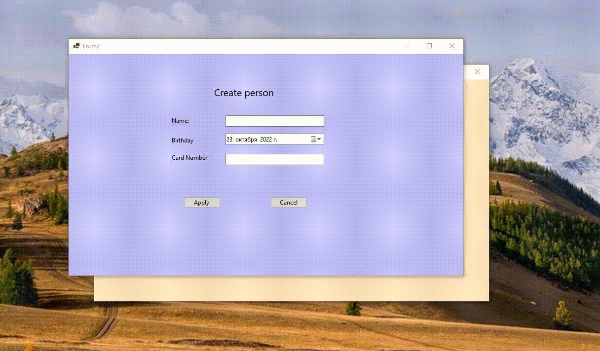

# Windows Forms "Bank"
Bank with user interface to create / edit person bank account.

## Forms
- **Main Form**: You will see all accounts created in Bank. You have buttons to create, edit and delete 
people. Also, you may sort accounts by name, card, age in ASCending / DESCending order.
- **Add person Form**: If you selected "Create" button in Main Form you have permissions to add new bank account.
- **Edit person Form**: If you selected "Edit" button in Main Form you will see an interface to edit selected account. 
But you don't have permission to edit birthday and card number. If you want edit birthday or card number you need to 
press `Ctrl` + `Shift` + `L` for go to Authorization.
- **Authorization Form**: If you in "Edit person Form" and pressed `Ctrl` + `Shift` + `L` you will see this form. You 
may create many of these forms. If you pass to form login = "admin" and password = "admin" (it is a secret :)) your 
"Edit person Form" will unblock all attributes, and you will have permission to edit birthday + card number.

## Demonstration

